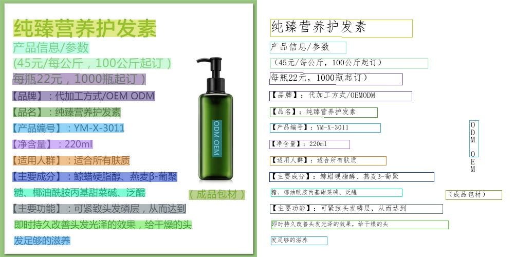
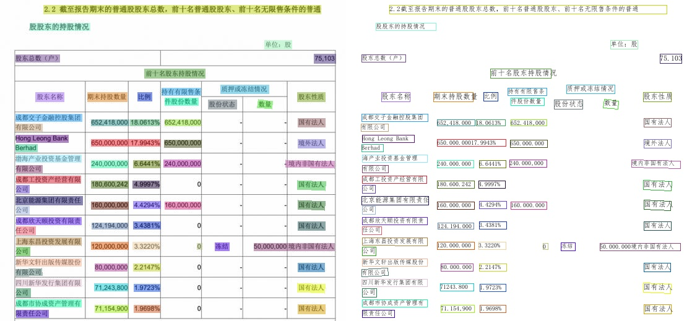
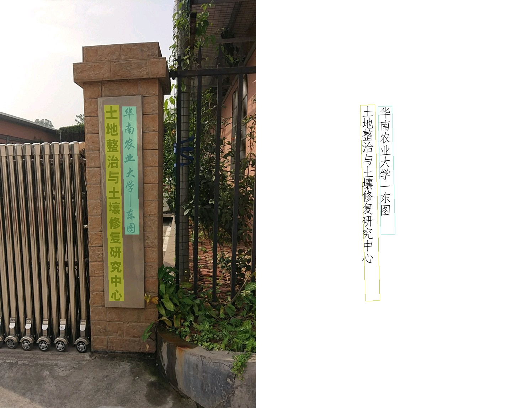

# [PaddleOCR2Pytorch](https://github.com/frotms/PaddleOCR2Pytorch)

简体中文 | [English](README_en.md)

## 简介
**”白嫖“**[PaddleOCR](https://github.com/PaddlePaddle/PaddleOCR)。

本项目旨在：

- 学习PaddleOCR
- 让PaddleOCR训练的模型在pytorch上使用
- 为paddle转pytorch提供参考

## 注意

`PytorchOCR`由`PaddleOCRv2.0+`动态图版本移植。

**近期更新**

- 2024.02.20 [PP-OCRv4](./doc/doc_ch/PP-OCRv4_introduction.md)，提供mobile和server两种模型
  - PP-OCRv4-mobile：速度可比情况下，中文场景效果相比于PP-OCRv3再提升4.5%，英文场景提升10%，80语种多语言模型平均识别准确率提升8%以上
  - PP-OCRv4-server：发布了目前精度最高的OCR模型，中英文场景上检测模型精度提升4.9%， 识别模型精度提升2%
- 2023.04.16 公式识别[CAN](https://github.com/PaddlePaddle/PaddleOCR/blob/release/2.6/doc/doc_ch/algorithm_rec_can.md)
- 2023.04.07 文本超分[Text Telescope](https://github.com/PaddlePaddle/PaddleOCR/blob/release/2.6/doc/doc_ch/algorithm_sr_telescope.md)
- 2022.10.17 文本识别：[ViTSTR](https://github.com/PaddlePaddle/PaddleOCR/blob/release/2.6/doc/doc_ch/algorithm_rec_vitstr.md)
- 2022.10.07 文本检测：[DB++](https://github.com/PaddlePaddle/PaddleOCR/blob/release/2.6/doc/doc_ch/algorithm_det_db.md)
- 2022.07.24 文本检测算法(FCENET)
- 2022.07.16 文本识别算法(SVTR)
- 2022.06.19 文本识别算法(SAR)
- 2022.05.29 [PP-OCRv3](https://github.com/PaddlePaddle/PaddleOCR/blob/release/2.5/doc/doc_ch/ppocr_introduction.md#pp-ocrv3)，速度可比情况下，中文场景效果相比于PP-OCRv2再提升5%，英文场景提升11%，80语种多语言模型平均识别准确率提升5%以上
- 2022.05.14 PP-OCRv3文本检测模型
- 2022.04.17 1种文本识别算法(NRTR)
- 2022.03.20 1种文本检测算法(PSENet)
- 2021.09.11 PP-OCRv2，CPU推理速度相比于PP-OCR server提升220%；效果相比于PP-OCR mobile 提升7%
- 2021.06.01 更新SRN
- 2021.04.25 更新AAAI 2021论文端到端识别算法PGNet
- 2021.04.24 更新RARE
- 2021.04.12 更新STARNET
- 2021.04.08 更新DB, SAST, EAST, ROSETTA, CRNN
- 2021.04.03 更新多语言识别模型，目前支持语种超过27种，[多语言模型下载](./doc/doc_ch/models_list.md)，包括中文简体、中文繁体、英文、法文、德文、韩文、日文、意大利文、西班牙文、葡萄牙文、俄罗斯文、阿拉伯文等，后续计划可以参考[多语言研发计划](https://github.com/PaddlePaddle/PaddleOCR/issues/1048)
- 2021.01.10 白嫖中英文通用OCR模型

## 特性

高质量推理模型，准确的识别效果

- 超轻量PP-OCR系列：检测+ 方向分类器+ 识别
- 超轻量ptocr_mobile移动端系列
- 通用ptocr_server系列
- 支持中英文数字组合识别、竖排文本识别、长文本识别
- 支持多语言识别：韩语、日语、德语、法语等

## [模型列表](./doc/doc_ch/models_list.md)（更新中）

PyTorch模型下载链接：https://pan.baidu.com/s/1r1DELT8BlgxeOP2RqREJEg 提取码：6clx

PaddleOCR模型百度网盘链接：https://pan.baidu.com/s/1getAprT2l_JqwhjwML0g9g 提取码：lmv7 

更多模型下载（包括多语言），可以参考[PT-OCR v2.0 系列模型下载](./doc/doc_ch/models_list.md)

## 文档教程
- [快速安装](./doc/doc_ch/installation.md)
- [模型预测](./doc/doc_ch/inference.md)
- [Pipline](#Pipline)
- [效果展示](#效果展示)
- [参考文献](./doc/doc_ch/reference.md)
- [FAQ](https://github.com/PaddlePaddle/PaddleOCR/blob/release/2.0/doc/doc_en/FAQ_en.md)
- [参考](#参考)

## TODO

- [ ] 前沿算法：文本检测 [DRRG](https://github.com/PaddlePaddle/PaddleOCR/blob/release/2.6/doc/doc_ch/algorithm_det_drrg.md)，文本识别 [RFL](https://github.com/PaddlePaddle/PaddleOCR/blob/release/2.6/doc/doc_ch/algorithm_rec_rfl.md)
- [ ] 文本识别：[ABINet](https://github.com/PaddlePaddle/PaddleOCR/blob/release/2.6/doc/doc_ch/algorithm_rec_abinet.md), [VisionLAN](https://github.com/PaddlePaddle/PaddleOCR/blob/release/2.6/doc/doc_ch/algorithm_rec_visionlan.md), [SPIN](https://github.com/PaddlePaddle/PaddleOCR/blob/release/2.6/doc/doc_ch/algorithm_rec_spin.md), [RobustScanner](https://github.com/PaddlePaddle/PaddleOCR/blob/release/2.6/doc/doc_ch/algorithm_rec_robustscanner.md)
- [ ] 表格识别：[TableMaster](https://github.com/PaddlePaddle/PaddleOCR/blob/release/2.6/doc/doc_ch/algorithm_table_master.md)
- [ ] [PP-Structurev2](./ppstructure/README_ch.md)，系统功能性能全面升级，适配中文场景，新增支持[版面复原](./ppstructure/recovery/README_ch.md)，支持**一行命令完成PDF转Word**
- [ ] [版面分析](./ppstructure/layout/README_ch.md)模型优化：模型存储减少95%，速度提升11倍，平均CPU耗时仅需41ms
- [ ] [表格识别](https://github.com/PaddlePaddle/PaddleOCR/blob/release/2.6/ppstructure/table/README_ch.md)模型优化：设计3大优化策略，预测耗时不变情况下，模型精度提升6%
- [ ] [关键信息抽取](https://github.com/PaddlePaddle/PaddleOCR/blob/release/2.6/ppstructure/kie/README_ch.md)模型优化：设计视觉无关模型结构，语义实体识别精度提升2.8%，关系抽取精度提升9.1%
- [ ] 文本识别算法([SEED](https://github.com/PaddlePaddle/PaddleOCR/blob/release/2.6/doc/doc_ch/algorithm_rec_seed.md))
- [ ] 文档结构化算法[关键信息提取](https://github.com/PaddlePaddle/PaddleOCR/blob/release/2.4/ppstructure/docs/kie.md)算法(SDMGR)
- [ ] 3种[DocVQA](https://github.com/PaddlePaddle/PaddleOCR/tree/release/2.4/ppstructure/vqa)算法(LayoutLM、LayoutLMv2，LayoutXLM)
- [ ] 文档结构分析[PP-Structure](https://github.com/PaddlePaddle/PaddleOCR/blob/release/2.2/ppstructure/README_ch.md)工具包，支持版面分析与表格识别（含Excel导出）

## PP-OCRv2 Pipline

    

[1] PP-OCR是一个实用的超轻量OCR系统。主要由DB文本检测、检测框矫正和CRNN文本识别三部分组成。该系统从骨干网络选择和调整、预测头部的设计、数据增强、学习率变换策略、正则化参数选择、预训练模型使用以及模型自动裁剪量化8个方面，采用19个有效策略，对各个模块的模型进行效果调优和瘦身(如绿框所示)，最终得到整体大小为3.5M的超轻量中英文OCR和2.8M的英文数字OCR。更多细节请参考PP-OCR技术方案 <https://arxiv.org/abs/2009.09941>

[2] PP-OCRv2在PP-OCR的基础上，进一步在5个方面重点优化，检测模型采用CML协同互学习知识蒸馏策略和CopyPaste数据增广策略；识别模型采用LCNet轻量级骨干网络、UDML 改进知识蒸馏策略和Enhanced CTC loss损失函数改进（如上图红框所示），进一步在推理速度和预测效果上取得明显提升。更多细节请参考PP-OCRv2[技术报告](https://arxiv.org/abs/2109.03144)。

## 效果展示
- 中文模型

    
    
    
    

- 英文模型

    

- 其他语言模型

    
    

## 参考

- [https://github.com/PaddlePaddle/PaddleOCR](https://github.com/PaddlePaddle/PaddleOCR)
- [https://github.com/WenmuZhou/PytorchOCR](https://github.com/WenmuZhou/PytorchOCR)
- [Paddle](https://github.com/PaddlePaddle)
- [Pytorch](https://pytorch.org/)
- [https://github.com/frotms/image_classification_pytorch](https://github.com/frotms/image_classification_pytorch)
- [https://github.com/PaddlePaddle/PaddleOCR/blob/release/2.7/doc/doc_ch/models_list.md](https://github.com/PaddlePaddle/PaddleOCR/blob/release/2.7/doc/doc_ch/models_list.md)

<iframe style="width:100%;height:auto;min-width:600px;min-height:400px;" src="https://star-history.com/embed?secret=Z2hwX2tRUHYxZDB3U3NOZEEyOUZhdnczQmQ3dU1sN3NjYTFwZ1gyWg==#frotms/PaddleOCR2Pytorch&Date" frameBorder="0"></iframe>
