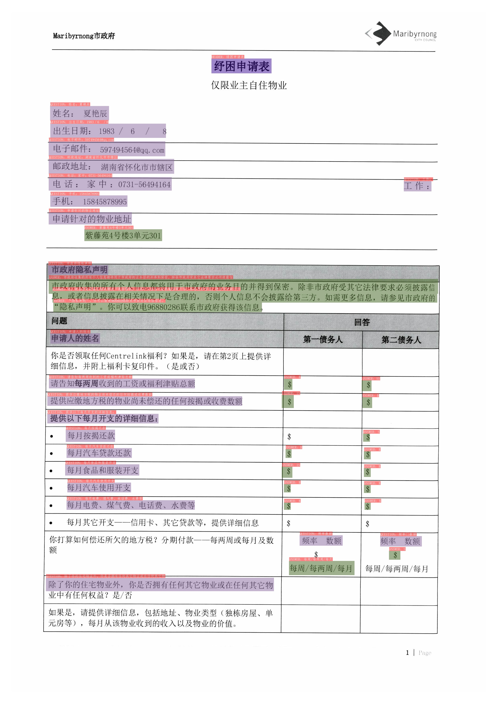
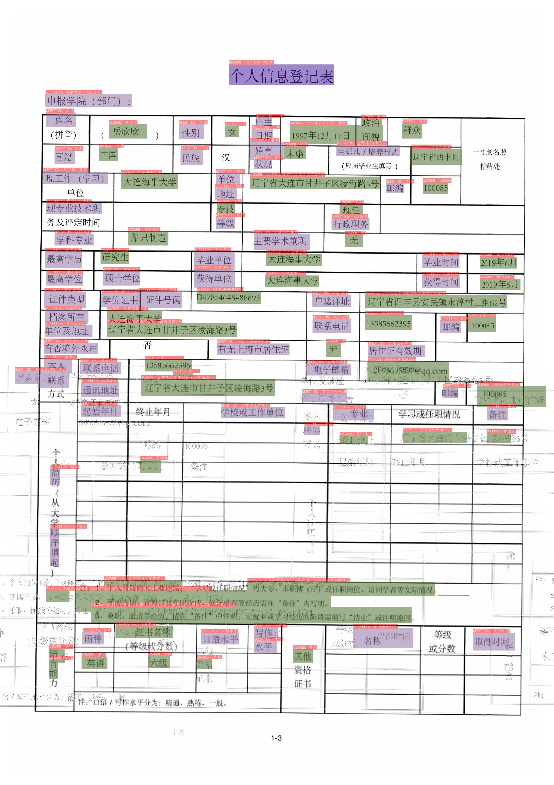
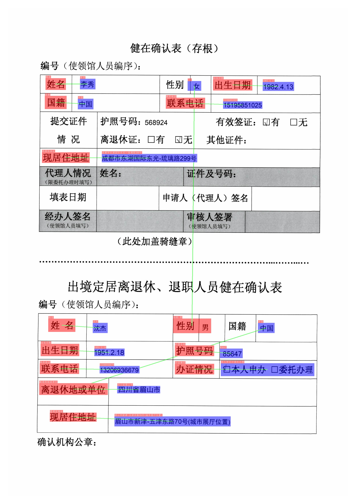
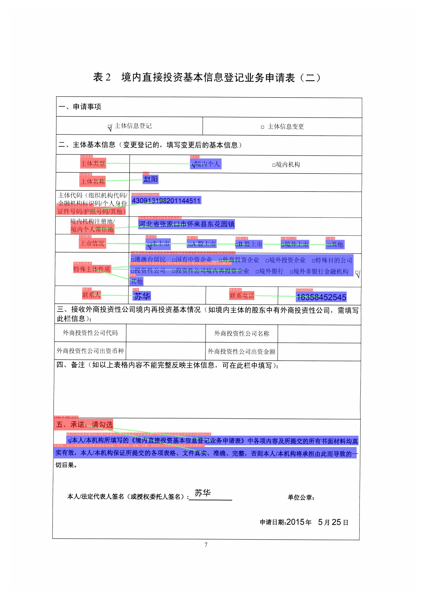

# 文档视觉问答(DOC-VQA)

VQA指视觉问答，主要针对图像内容进行提问和回答,DOC-VQA是VQA任务中的一种，DOC-VQA主要针对文本图像的文字内容提出问题。

PT-Structure 里的 DOC-VQA算法基于PaddleNLP自然语言处理算法库进行开发。

主要特性如下：

\- 集成[LayoutXLM](https://arxiv.org/pdf/2104.08836.pdf)模型以及PT-OCR预测引擎。

\- 支持基于多模态方法的语义实体识别 (Semantic Entity Recognition, SER) 以及关系抽取 (Relation Extraction, RE) 任务。基于 SER 任务，可以完成对图像中的文本识别与分类；基于 RE 任务，可以完成对图象中的文本内容的关系提取，如判断问题对(pair)。

\- 支持SER任务和RE任务的自定义训练。

\- 支持OCR+SER的端到端系统预测与评估。

\- 支持OCR+SER+RE的端到端系统预测。

***Note***：本项目基于 [LayoutXLM](https://arxiv.org/pdf/2104.08836.pdf) 在Paddle 2.2上的开源实现，同时经过飞桨团队与**中国工商银行**在不动产证场景深入打磨，联合开源。

## 转换(需要paddleocr模型):

```bash
cd ${PaddleOCR2Pytorch_PATH}/converter
# 根据paddle原始模型，在该paddle原始模型文件夹下生成model_state.pth，转换完成后可以删除paddle的模型文件model_state.pdparams

# layoutxlm ser
python3.7 ./layoutxlm_ser_converter.py --model_name_or_path your_org_PP-Layout_v1.0_ser_pretrained_dir

#layoutxlm re
python3.7 ./layoutxlm_re_converter.py --re_model_name_or_path your_org_PP-Layout_v1.0_re_pretrained_dir
```

## 使用(需要paddleocr模型和结果)：

```bash
cd ${PaddleOCR2Pytorch_PATH}/ptstructure/vqa
# 程序兼容加载paddle模型或pytorch模型

# layoutxlm ser
python3.7 infer_ser_e2e.py --det_model_path ptocr_general_model_ch_ptocr_v2_det_infer.pth --rec_model_path ptocr_general_model_ch_ptocr_v2_rec_infer.pth --model_name_or_path your_PP-Layout_v1.0_ser_pretrained_dir --output_dir ./output/ser_e2e --infer_imgs ./images/input/zh_val_0.jpg

#layoutxlm ser_re
python3.7 infer_ser_re_e2e.py --det_model_path ptocr_general_model_ch_ptocr_v2_det_infer.pth --rec_model_path ptocr_general_model_ch_ptocr_v2_rec_infer.pth --model_name_or_path your_PP-Layout_v1.0_ser_pretrained_dir --re_model_name_or_path your_PP-Layout_v1.0_re_pretrained_dir --output_dir ./output/ser_re_e2e/ --infer_imgs ./images/input/zh_val_40.jpg
```

## 效果演示

### ser





### ser_re





## References

- [LayoutXLM: Multimodal Pre-training for Multilingual Visually-rich Document Understanding](https://arxiv.org/pdf/2104.08836.pdf)
- [microsoft/unilm/layoutxlm](https://github.com/microsoft/unilm/tree/master/layoutxlm)
- [XFUND dataset](https://github.com/doc-analysis/XFUND)